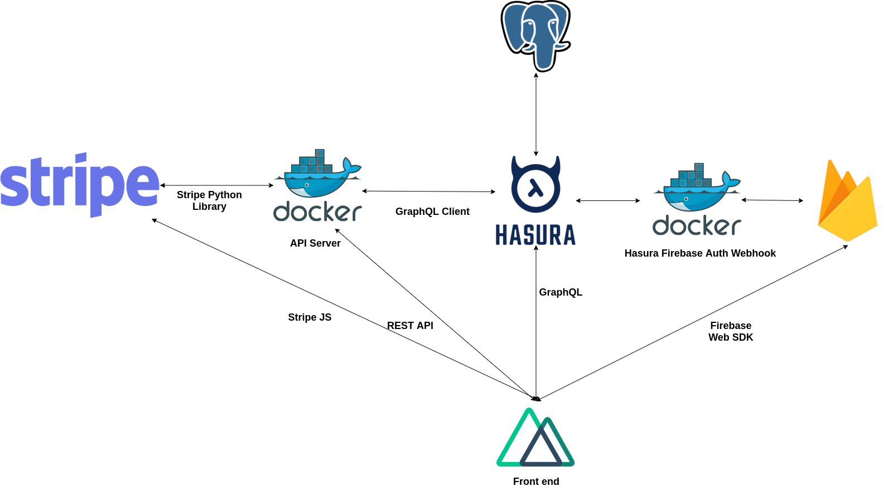

# GraphQL Chat

See me building this app in public in this [Twitter thread](https://twitter.com/sdil/status/1306045334414479360).

This project is built in Jamstack architecture. The frontend application is built and served from Netlify. This project uses:

- PostgreSQL DB
- Firebase for authentication & social login
- Hasura GraphQL engine for data query & manipulation in GraphQL
- [Hasura Firebase Auth Webhook](https://github.com/sdil/hasura-firebase-auth-webhook) for Hasura to validate JWT token from frontend
- [API Server](https://github.com/sdil/graphql-chat/tree/master/api-server) for custom logics in REST API built using FastAPI
- NuxtJS for frontend
- Docker-compose (non-production deployment)

## Table of Contents

- [Objective](#objective)
- [Key Takeaway](#key-takeaway)
  - [Frontend](#frontend)
  - [Hasura](#hasura)
  - [API Server](#api-server)
- [TODO](#todo)

## Objective

Learning GraphQL in public. I personally think that I enjoyed writing GraphQL in frontend but I don't think that I'll enjoy writing the GraphQL server (eg. using Apollo Server or Graphene).

## Key Takeaway

### Frontend

- There're a lot of useful Nuxt plugins available [here](https://modules.nuxtjs.org/). Please check out each of them.
- Use [Nuxt Toast](https://github.com/nuxt-community/modules/tree/master/packages/toast) to acknowledge users conveniently.
- Use [Dayjs](https://github.com/nuxt-community/dayjs-module) (available as Nuxt module) to humanize time (make sure to import `relativeTime` plugin)
- NuxtJS reads `.env` file automatically. If you have a different file name for your dotenv, you'll need to explicitly configure the `nuxt.config.js`
- In NuxtJS/VueJS, use `this.$router.go()` to refresh the whole page. This is useful after user login & require a full page & components reload.
- **[Apollo]** Apollo will store user token named `apollo-token` in the browser cookie and will use it to request to GraphQL endpoints
- **[Apollo]** Apollo by default will set `authorization` HTTP header instead of `Authorization` header to GraphQL endpoint.
- **[Apollo]** When you need to query GraphQL with variable reactively, you'll need to do it [this](https://vue-apollo.netlify.app/guide/apollo/queries.html#reactive-parameters) way instead of the normal query.
- Eventhough Vue Apollo & Hasura supports websocket out of the box and really easy to setup, please avoid using ws connection whenever possible because the browser adoption is still not great today.
- **[Firebase]**

### Hasura

- Remember to add and version control the DB migration
- You'll need a PostgreSQL view to query for aggregation (eg. get number of messages by room, get number of messages by user)
- You'll need PostgreSQL custom function to do special things in Hasura
- You'll need to utilize PostgreSQL advantages when using Hasura to extend it

### API Server

- **[FastAPI]** FastAPI documentation is not comprehensive. Some of the things (eg reading request Auth header) are not documented in the official doc.
- The maintainer created an excellent base Docker image `tiangolo/uvicorn-gunicorn-fastapi:xxxx` to be used with FastAPI implementation

## TODO

- Write Python & Go unittests
- Use Sentry to track errors
- Use Google Analytics to analyze users/visitors
- Use pubsub (eg. Kafka) to do data lake & data collection
